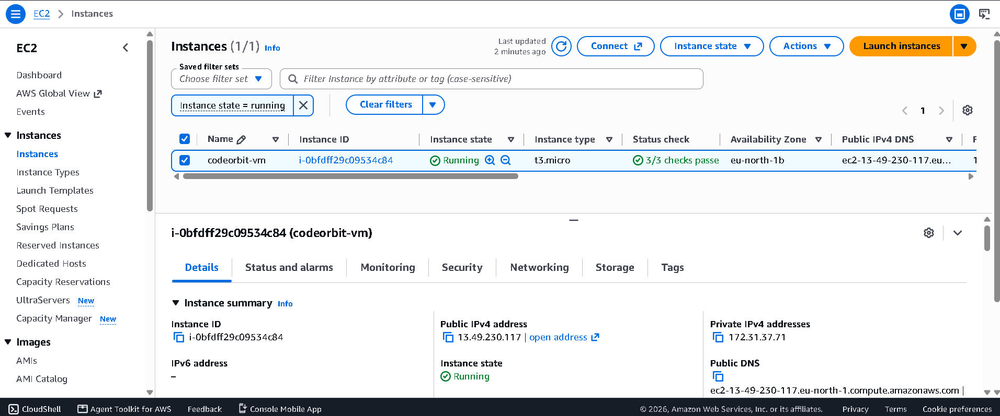
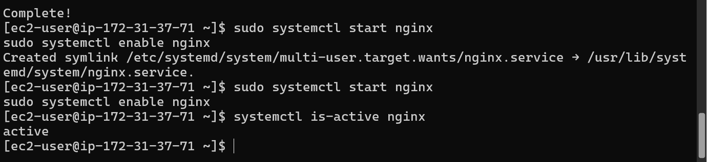
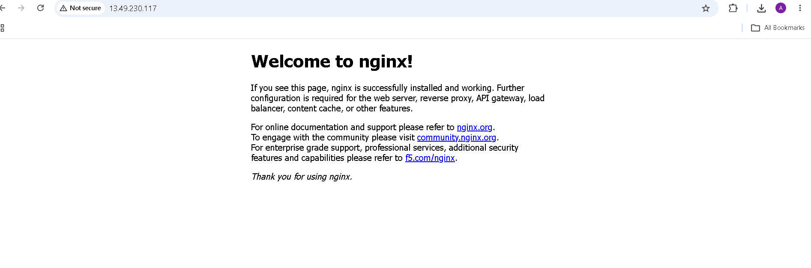

# Task 2 — Virtual Machine Setup on AWS EC2

**Arya Yaligar | CodeOrbit Tech — Cloud Computing Internship (Batch 8) | October 2026**

## 1. Objective

Launch a virtual machine on the AWS Free Plan, configure its firewall, connect to it over SSH, install the **nginx** web server, and verify it serves a live page — documenting each step with screenshots.

## 2. Setup summary

| Item | Value |
|---|---|
| Instance name / ID | `codeorbit-vm` / `i-0bfdff29c09534c84` |
| Instance type | `t3.micro` (2 vCPU, Free Plan eligible) |
| Operating system | Amazon Linux 2023 (`ami-01e082ac2f79f3918`) |
| Region / Availability Zone | eu-north-1 (Stockholm) / eu-north-1b |
| Public IPv4 address | `13.49.230.117` |
| Storage | 8 GiB gp3 root volume |
| Key pair | `codeorbit-key` (.pem, downloaded at launch) |
| Security group | `launch-wizard-1`: SSH (22) from My IP + EC2 Instance Connect prefix list; HTTP (80) from 0.0.0.0/0 |
| Application installed | nginx 1.30.5, enabled at boot, verified `active` |

## 3. Steps performed

1. **Launched the instance** with the EC2 launch wizard: named it `codeorbit-vm`, kept the Amazon Linux 2023 AMI and `t3.micro` type, created the `codeorbit-key` key pair, enabled auto-assign public IP, created security group `launch-wizard-1` (SSH from My IP, HTTP from anywhere), and kept the default 8 GiB volume.
2. **Waited for 3/3 status checks** to pass before connecting.
3. **Connected over SSH** from Windows PowerShell using the downloaded `.pem` key (after fixing its Windows file permissions with `icacls` — see §5).
4. **Installed nginx:**
   ```bash
   sudo dnf update -y
   sudo dnf install -y nginx
   sudo systemctl start nginx
   sudo systemctl enable nginx
   systemctl is-active nginx   # → active
   ```
5. **Verified in the browser:** opened `http://13.49.230.117` — the "Welcome to nginx!" page loaded, proving the security-group HTTP rule and the server both work.
6. **Planned cleanup:** stop (or terminate) the instance after the screenshots so it doesn't keep using Free Plan credits — a running VM consumes credits for the instance hours and the public IPv4 address.

## 4. Screenshots







## 5. Issues faced and how they were fixed

- **EC2 Instance Connect failed at first.** Likely causes: the status checks were still initializing, and I had picked the *IPv6* EC2 Instance Connect prefix list while the instance has no IPv6 address. The browser-based connection was never retried after that — the connection that actually worked was direct SSH from Windows PowerShell with the `.pem` key (see next point).
- **Windows SSH refused the .pem key** ("bad permissions / UNPROTECTED PRIVATE KEY FILE"). Fixed with `icacls codeorbit-key.pem /reset`, then `/grant:r` for the current user and `/inheritance:r` — after which `ssh -i codeorbit-key.pem ec2-user@13.49.230.117` connected on the first try.

## 6. Cost note

This build ran on the AWS Free Plan ($100 in credits at signup, up to $200 total, 6 months — no charges possible without upgrading to Paid). Usage was only a few hours of `t3.micro`, intended to stay well within the credit allowance; exact billing was not separately checked. The instance was slated to be stopped (or terminated) right after the screenshots to avoid further credit use.

## 7. Conclusion

The virtual machine was provisioned, secured, connected to, and turned into a working web server in under an hour, all on free-plan credits. The exercise demonstrated the full IaaS loop from Task 1's report: renting raw infrastructure (EC2), configuring the network boundary (security groups), and managing the software stack (nginx) myself.
