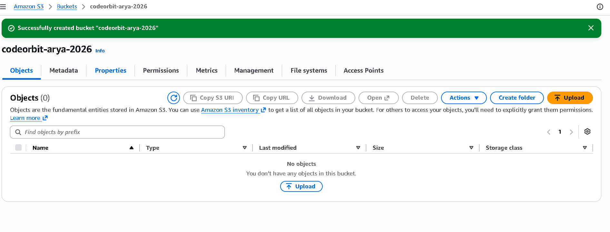
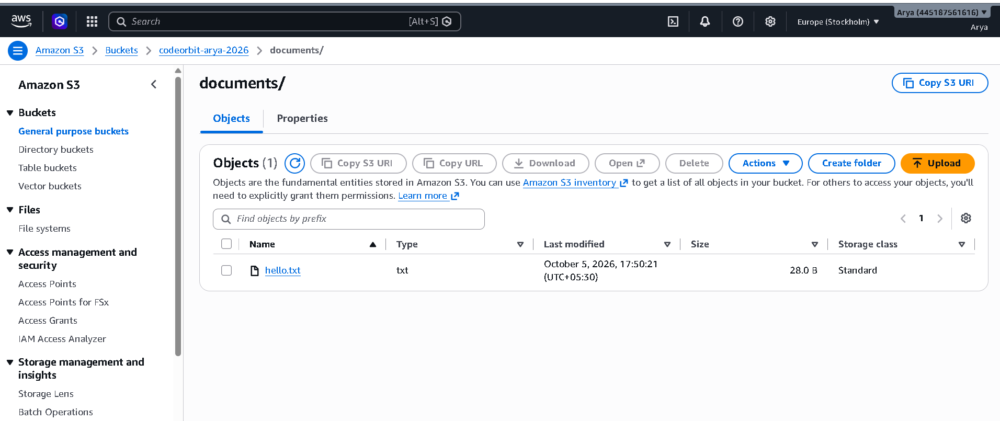
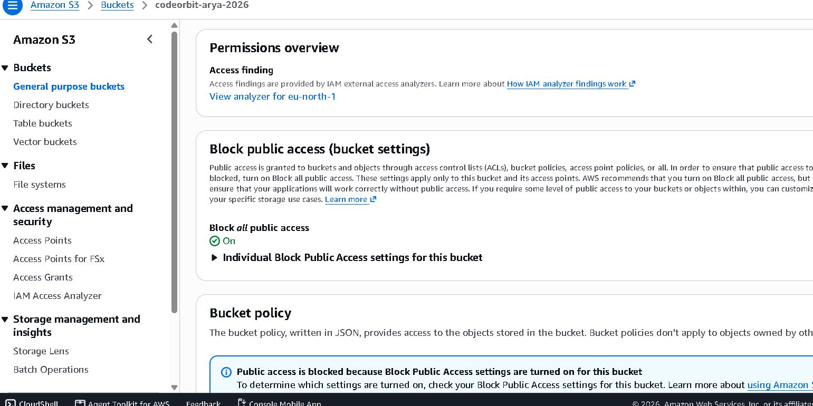
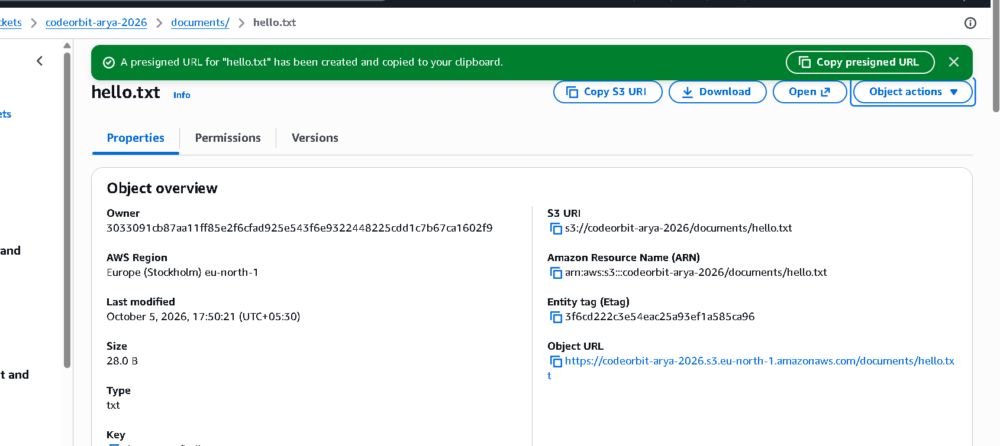

# Task 3 — Cloud Storage & File Management on Amazon S3

**Arya Yaligar | CodeOrbit Tech — Cloud Computing Internship (Batch 8) | October 2026**

## 1. Objective

Set up a cloud storage bucket on the AWS Free Plan, practice uploading, organizing and managing files and folders, configure access permissions, and document the setup with screenshots.

## 2. Setup summary

| Item | Value |
|---|---|
| Bucket name | `codeorbit-arya-2026` (globally unique) |
| Region | eu-north-1 (Stockholm) |
| Object ownership | ACLs disabled (recommended default) |
| Block Public Access | **ON** — bucket and objects not public (secure default) |
| Folders created | `documents/`, `images/` |
| Files uploaded | `documents/hello.txt` (28 B), `images/Screenshot 2026-10-05 171116.png` (102.6 KB) |
| Access demo | Presigned URL for `hello.txt`, 10-minute expiry |

## 3. Steps performed

1. **Created the bucket** `codeorbit-arya-2026` in eu-north-1 via the S3 console, keeping all defaults — including **Block all public access ON**.
2. **Organized storage:** created two folders, `documents/` and `images/`; uploaded `hello.txt` ("Hello from my cloud storage!") into `documents/` and a photo into `images/`.
3. **Managed files:** verified uploads in the Objects listing (name, type, size, storage class all shown correctly).
4. **Configured permissions:** confirmed on the Permissions tab that Block Public Access is ON — the bucket is private by default.
5. **Demonstrated controlled sharing:** generated a **presigned URL** for `hello.txt` with a 10-minute expiry — a time-limited link that grants access to one private file without making anything public.

> **Why a presigned URL instead of "make public"?** Real teams keep buckets private and share individual files through expiring signed links (or bucket policies). It proves the same access-control concept the task asks for, without ever exposing the bucket.

## 4. Screenshots

## 5. Cost note

S3's 5 GB of standard storage is always-free, and this task used a few kilobytes. The bucket sits inside the AWS Free Plan ($100 in credits at signup, up to $200 total) — effective cost: zero.

## 6. Conclusion

The bucket was created, organized into folders, filled with files, locked down with Block Public Access, and shared safely through a presigned URL. The exercise covered the core object-storage workflow — create, organize, manage, permission — that underpins nearly every cloud application, from static website hosting to data lakes.
